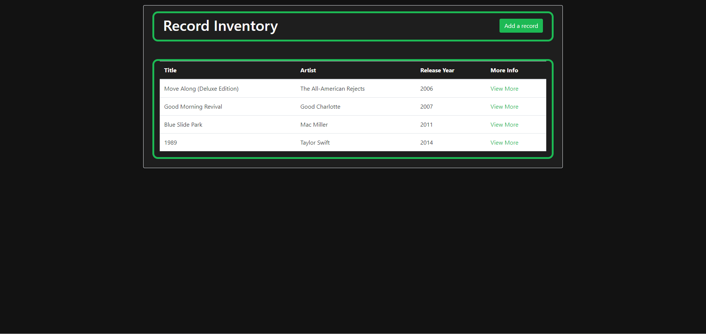
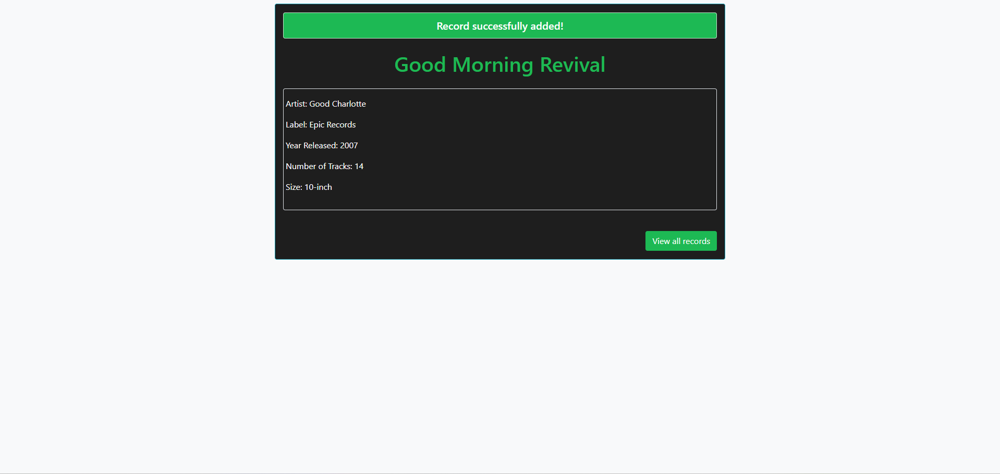
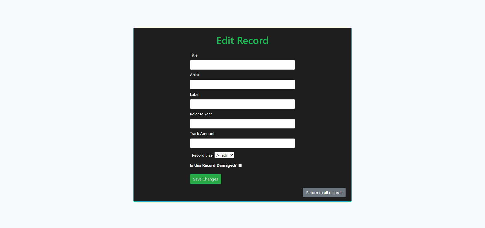

# Music Record Inventory Management System
 
This is a Java Spring Boot application that serves as a Music Record Inventory Management System. The application is built using the Spring MVC framework and utilizes Thymeleaf for server-side templating.

## Features

- **CRUD Operations:** Perform Create, Read, Update, and Delete operations on music records.
- **Thymeleaf Templates:** Use Thymeleaf templates for dynamic HTML rendering on the server side.
- **MVC Architecture:** Follow the Model-View-Controller pattern for a well-organized and modular codebase.
- **Spring Boot:** Leverage the power of Spring Boot for easy configuration and rapid development.

## Prerequisites

- Java Development Kit (JDK) 8 or higher
- Maven (for building and managing dependencies)
- Your favorite IDE (IntelliJ IDEA, Eclipse, etc.)

- ## Screen Grabs
-  
 
 
 


## Getting Started

1. **Clone the Repository:**

   ```bash
   git clone https://github.com/your-username/music-record-inventory.git
